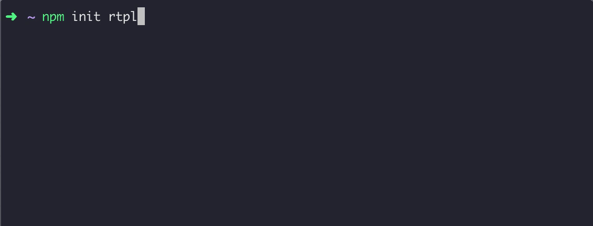

create-rtpl: Create React Template CLI
=================================
create rtpl installer for [react-template](https://github.com/kingzez/react-template)

[](https://npmjs.org/package/create-rtpl)
[](https://npmjs.org/package/create-rtpl)
[](https://github.com/kingzez/create-rtpl/blob/master/package.json)

<p align="center">
	<br>
	
	<br>
</p>

<!-- toc -->
### Usage
<!-- usage -->
install react-template project

npm version > 6.1.0
```shell
npm init rtpl
```

npm version < 6.1.0
```shell
npx create-rtpl
```

global
```shell
npm i -g create-rtpl
rtpl
```
### TODO
- [x] download template
- [ ] write pkg name to package.json, rm .git and some useless dotfile
- [ ] select different version (eg: typescript)

### License
MIT